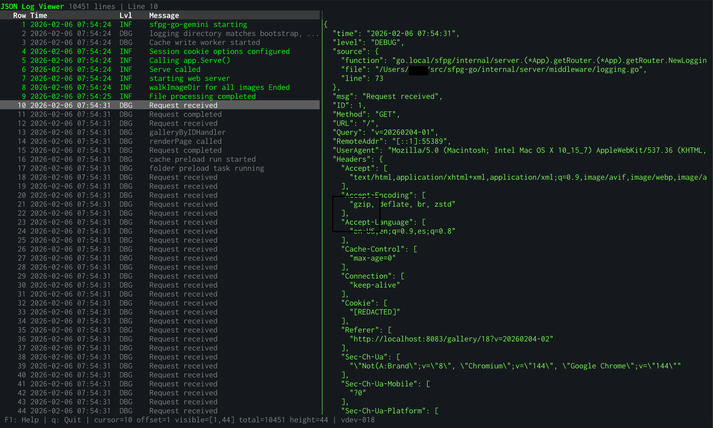

# JSON Log Viewer

[]()
[](https://golang.org/)
[](LICENSE)

A high-performance terminal UI application for viewing large JSON log files (multi-GB). 
Features a two-pane interface with a scrollable table view on the left and pretty-printed JSON detail view on the right.


## Motivation

I created this for two reasons:

1. I needed a better was to view large debug logs generated by Go's [log/slog](https://pkg.go.dev/log/slog). 
I took a quick look around the normal places and couldn't find anything already out there. This surprised me.
There probably is and I probably missed it

2. I have been reading great things about Kimi Code and Kimi K2.5.  I wanted to give it a try.  This app was
initially built in 8 minutes in Kimi Code using the prompt [Kimi-K2.5-Prompt.md](kimi-k2.5-prompt.md) and the 
[golang-patterns](https://skills.sh/affaan-m/everything-claude-code/golang-patterns) skill. The
initial build largely worked as expected. There were some issues with the independent scrolling of the left
and right panes as well as with the panel resize. It took about another hour in the chat with me testing and
Kimi make changes.



## Features

- **Memory-mapped file access**: Handles files larger than available RAM efficiently using `mmap`
- **Fast indexing**: Builds a line offset index for O(1) line access (only 8 bytes per line overhead)
- **Vim-style navigation**: Full support for vim motions (j/k, gg/G, H/M/L, Ctrl+u/d, etc.)
- **Pane resizing**: Adjustable split between table and detail views (Ctrl+w then >/<)
- **Pretty printing**: Formats JSON with 2-space indentation in the detail pane
- **Level-based coloring**: Syntax highlighting with different colors for DEBUG, INFO, WARN, ERROR, FATAL
- **Detail scrolling**: Scroll long JSON entries horizontally with h/l keys
- **Keyboard shortcuts**: F1/? for help, q to quit, vim-style bindings

## ToDo

- **Mouse support**: Click to select rows, scroll panes, and drag the pane separator
 
## Installation

### Prerequisites

- Go 1.21 or later (for building from source)

### From Source

```bash
# Clone the repository
git clone https://github.com/example/jsonlogviewer.git
cd jsonlogviewer

# Build
make build

# Or directly with go
go build -o jsonlogviewer ./cmd/jsonlogviewer
```

### Install to $GOPATH/bin

```bash
go install ./cmd/jsonlogviewer
```

## Usage

### View a file

```bash
./jsonlogviewer /path/to/app.log
```

### Pipe from stdin

```bash
cat app.log | ./jsonlogviewer
journalctl -o json | ./jsonlogviewer
kubectl logs my-pod | ./jsonlogviewer
docker logs my-container 2>&1 | ./jsonlogviewer
```

### Debug mode

```bash
./jsonlogviewer -debug /path/to/app.log
```

This creates debug logs in `./logs/logview-YYYYMMDD-HHMMSS.log`.

## Keyboard Navigation

### Basic Navigation

| Key | Action |
|-----|--------|
| `↑` / `↓` | Move cursor up/down 1 line |
| `k` / `j` | Vim-style move up/down |
| `PgUp` / `PgDn` | Page up/down |
| `Ctrl+b` / `Ctrl+f` | Page up/down (vim-style) |
| `Home` / `End` | First/last line |
| `gg` / `G` | Go to first/last line |
| `{n}gg` / `{n}G` | Go to line n (e.g., `150gg`) |

### Screen Navigation

| Key | Action |
|-----|--------|
| `H` / `M` / `L` | Move cursor to top/middle/bottom of visible screen |
| `Ctrl+e` / `Ctrl+y` | Scroll screen 1 line (cursor stays) |
| `Ctrl+u` / `Ctrl+d` | Half-page up/down (cursor moves with screen) |

### Pane Controls

| Key | Action |
|-----|--------|
| `Ctrl+w` | Enter resize mode (2 second timeout) |
| `>` / `<` | Resize split right/left (in resize mode) |
| `h` / `l` | Scroll detail pane up/down |

### Other

| Key | Action |
|-----|--------|
| `F1` or `?` | Toggle help overlay |
| `q` | Quit |
| `Esc` | Cancel / Show exit confirmation |

### Mouse (ToDo)

- **Click**: Select a row
- **Scroll wheel**: Scroll the active pane
- **Drag separator**: Resize the left pane

## Example Log Format

The viewer expects JSON log lines in the following format:

```json
{"time":"2024-01-15T10:30:00Z","level":"info","msg":"Application started"}
{"time":"2024-01-15T10:30:01Z","level":"debug","msg":"Connecting to database","source":{"function":"connectDB","file":"db.go","line":42}}
{"time":"2024-01-15T10:30:02Z","level":"error","msg":"Connection failed","error":"connection refused"}
```

### Supported Field Names

Fields are detected case-insensitively:

| Field | Supported Names |
|-------|-----------------|
| Time | `time`, `timestamp`, `ts`, `@timestamp` |
| Level | `level`, `severity`, `lvl` |
| Message | `msg`, `message`, `text` |

## Development

### Project Structure

```
internal/
  index/      # Memory-mapped file access and line offset indexing
  parser/     # JSON parsing (gjson) and pretty formatting
  nav/        # Viewport calculations and vim motion logic
  pool/       # Generic sync.Pool wrapper
  tui/        # Bubble Tea TUI model and UI components
cmd/jsonlogviewer/  # Main application entry point
```

### Design Principles

This project follows [Go Proverbs](https://go-proverbs.github.io/):

- **"Clear is better than clever"** — Readable code over optimization tricks
- **"A little copying is better than a little dependency"** — Minimal external dependencies
- **"The bigger the interface, the weaker the abstraction"** — Small interfaces (1-2 methods)
- **"Accept interfaces, return structs"** — Functions accept narrow interfaces
- **"Don't panic"** — Explicit error returns, no panic in production code
- **"Make the zero value useful"** — Structs work without initialization
- **"Documentation is for users"** — Complete GoDoc comments

### Building

```bash
# Run all checks (test, lint, build)
make

# Individual targets
make test      # Run tests with coverage
make lint      # Run golangci-lint, goimports, gofmt
make build     # Build binary to ./bin/jsonlogviewer
```

### Testing

```bash
# Run all tests
go test ./...

# Run tests with coverage
go test ./... -cover

# Run benchmarks
go test ./... -bench=.

# Run linter
make lint
```

### Test Coverage

All internal packages maintain >80% test coverage:
- `index`: ~79%
- `nav`: ~83%
- `parser`: ~95%
- `pool`: 100%
- `tui`: ~85%

## Dependencies

- [bubbletea](https://github.com/charmbracelet/bubbletea) - TUI framework
- [lipgloss](https://github.com/charmbracelet/lipgloss) - Styling
- [gjson](https://github.com/tidwall/gjson) - Fast JSON parsing
- [golang.org/x/exp/mmap](https://pkg.go.dev/golang.org/x/exp/mmap) - Memory-mapped files

## Troubleshooting

### Large files

The viewer uses memory-mapped file access, so files much larger than RAM can be viewed. 
However, the initial index build requires scanning the entire file once to build the line offset index.

### Performance

For optimal performance with very large files (>10GB):
- Use an SSD if possible (faster random access during indexing)
- The index is built on first load; subsequent operations are fast

### Debug logging

If you encounter issues, run with `-debug` to enable detailed logging:

```bash
./jsonlogviewer -debug problematic.log
```

Check the generated log files in `./logs/` for diagnostic information.

## Contributing

Contributions are welcome! Please:

1. Fork the repository
2. Create a feature branch (`git checkout -b feature/amazing-feature`)
3. Commit your changes (`git commit -m 'Add amazing feature'`)
4. Push to the branch (`git push origin feature/amazing-feature`)
5. Open a Pull Request

Please ensure:
- Tests pass (`make test`)
- Linter passes (`make lint`)
- Code follows Go conventions and the project's design principles

## License

MIT License - see [LICENSE](LICENSE) for details.

## Acknowledgments

- Built with [Bubble Tea](https://github.com/charmbracelet/bubbletea) and [Lipgloss](https://github.com/charmbracelet/lipgloss) by Charm
- JSON parsing powered by [gjson](https://github.com/tidwall/gjson)
- Inspired by tools like `less`, `tail`, and `jq`
